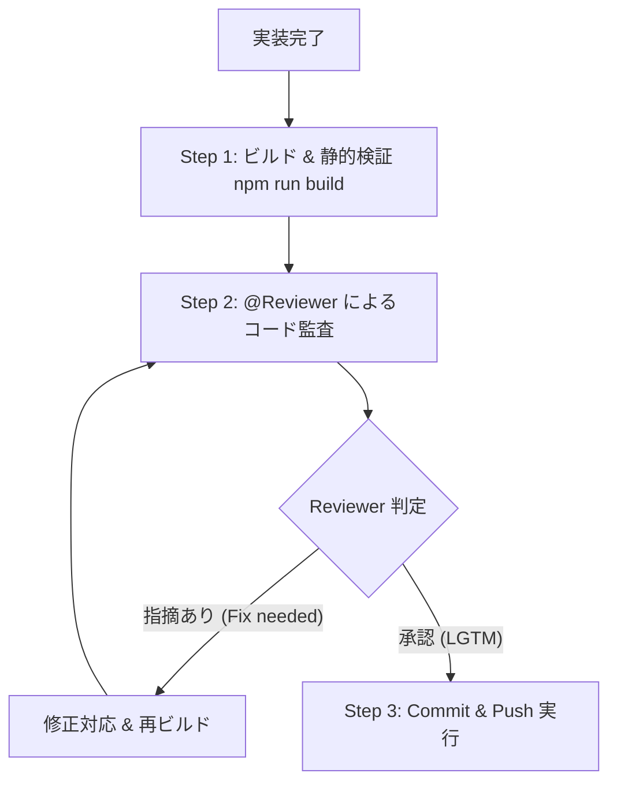

# Pre-Push 開発・レビュー必須ルーティン

本プロジェクトでは、コードの品質・安全性・SEO・UXを常に最高水準に保つため、**Git Push を実行する前に必ず以下のチェック＆「@Reviewer によるコードレビュー」を実施する**ことを必須ルールとします。

---

## 👥 チーム体制の冒頭明記
すべての報告・対応・レビューにおいて、冒頭に以下のプロジェクト体制を明記する：
- **[CEO]** AI Agent / プロジェクト全体統括・グロース戦略判断
- **[Director]** 進行管理・仕様策定・タスク管理
- **[Reviewer / QA Lead]** コード品質・セキュリティ・パフォーマンス・アクセシビリティ監査
- **[Tech Lead / Fullstack Engineer]** カードDB・デッキビルダー・AIチャット・静的生成システム開発
- **[CMO / Marketing Lead]** X（旧Twitter）自動配信・SEO最適化・バイラル施策
- **[Data Analyst]** GA4イベントトラッキング設計・CVR/送客データ分析

---

## 🔄 Push前 必須ワークフロールーティン

### Step 1: ビルド & 静的健全性検証
- `npm run build` を実行し、全カード/レシピページの静的生成およびCSSミニファイがエラーなく通ることを確認する。

### Step 2: @Reviewer による品質チェック観点
1. **🔒 セキュリティ & 秘匿情報**
   - XSS対策（動的HTML挿入箇所での `escapeHtml` 漏れがないか）
   - 外部リンクの `target="_blank"` に対する `rel="noopener noreferrer"` の徹底
   - `.env` や API キー等の秘匿情報がコミット対象に含まれていないか（`.gitignore` の遵守）
2. **⚡ パフォーマンス & SEO**
   - 不要なレンダリングや同期ブロック処理の有無
   - 構造化データ（JSON-LD / FAQPage 等）のスキーマ整合性
3. **📱 UX / a11y & エッジケース**
   - SP（モバイル）および PC の両方で破綻がないか
   - ライト / ダーク両テーマでのコントラスト比・視認性
   - データ未取得時や配列が空（デッキ0枚など）のフォールバック・トースト通知
4. **🧹 コード品質・保守性**
   - TypeScript の型安全性、命名規則、不要なデバッグコードの除去

### Step 3: @Reviewer の LGTM 獲得後に Commit & Push
- レビュー結果で「LGTM（承認）」となった場合のみ、コミットおよびリモートへのプッシュを実行する。
