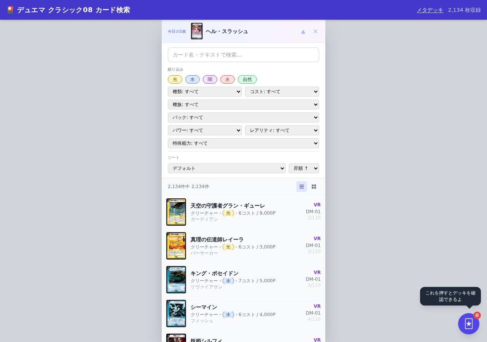

# デュエル・マスターズ クラシック08 データベース

デュエル・マスターズ **クラシック08環境** のカード検索・デッキ構築・メタ分析ができる静的Webデータベースです。全 **2,196枚** のカードと **462件** のデッキレシピを収録しています。

🔗 **デモ:** https://t1k2a.github.io/duelmasters-classic08-database/



> ⚠️ 本プロジェクトは非営利のファンメイドであり、株式会社タカラトミー様および関係各社とは一切関係ありません。カード情報・画像の権利はすべて権利者に帰属します。

## 主な機能

- **カード検索** — 全2,196枚を文明（光/水/闇/火/自然）・種類・コスト・種族・パック・パワー・レアリティ・特殊能力で絞り込み。名前/テキストのインクリメンタル検索とハイライト対応。リスト/グリッドの表示切替。
- **カード詳細** — 個別URL（`/card/dm01-001/`）でカードごとのページを持ち、SEO・SNS共有に対応。殿堂レギュレーション（殿堂🏅 / プレミアム殿堂🚫）バッジを表示。
- **デッキビルダー** — カードを選んで40枚デッキを組み立て。
- **デッキレシピ推薦** — カード詳細から、そのカードを採用している実戦レシピを推薦表示。関連カードも提示。
- **メタデッキTier表** — クラシック08環境の主要メタデッキ（ボルメテウスコントロール / 天門 / サバキストライク / 除去サファイア / ネクラコントロール）を解説。
- **今日の1枚** — 日替わりでカードをピックアップ。


## 使い方

### オンライン

ブラウザで [デモサイト](https://t1k2a.github.io/duelmasters-classic08-database/) を開くだけで利用できます。

### ローカルで動かす

```bash
# 依存をインストール
npm install

# 静的サイトをビルド（cards.json と個別カードページを生成）
npm run build

# public/ をローカルサーバで配信
npm run serve
# → http://localhost:3000 などで開く
```

`data/raw/` がない環境で、追跡済み `public/cards.json` を使って全ページ生成を検証する場合は、`BUILD_REUSE_CARDS_JSON=true npm run build` を実行できます。この明示モードでは既存カタログの形式を検証し、`cards.json` を書き換えず再利用します。raw HTMLは存在しても読み込まないため、再取り込みやカード収録の完全性の検証にはなりません。不正・空・欠損カタログでは失敗します。通常の `npm run build` は従来どおり完全な `data/raw/` が必要です。ビルドはその他の `public/` 生成物を更新するため、検証用コピーでの実行を推奨します。

> 📝 静的ページ（`public/card/`・`public/recipe/`）と `sitemap.xml` は CI ではビルドされません。データ更新時は `npm run build:card-pages` でローカル生成し、`public/` ごとコミットしてください。

## GA4週次レポート

毎週月曜09:00（日本時間）、`Weekly GA4 Analytics & Strategy Report` が実測レポートを生成し、デフォルトブランチの `docs/marketing/ga4-action-strategy.md` に自動保存します。レポート末尾には生成元のActions実行URLを記録します。Codexで更新後のリポジトリを開き、「GA4週次レポートを確認して」と依頼すれば、Summaryの貼り付けは不要です。既存の作業環境ではリポジトリの最新化が必要です。

初回は変更をデフォルトブランチに反映した後、Actionsから `Run workflow` を実行してください。`GA4_PROPERTY_ID` と `GOOGLE_APPLICATION_CREDENTIALS` のSecretsが必要です。モック実行・取得失敗・デフォルトブランチ以外の実行では保存済みレポートを更新しません。デフォルトブランチで実測データを取得できた実行ではダウンロード用Artifactも7日間保持します。

保存ジョブは `GITHUB_TOKEN` の `contents: write` を使用します。ブランチ保護や組織ポリシーで書き込みが禁止されている場合、自動保存は失敗するため設定の調整が必要です。レポートの閲覧範囲はリポジトリの公開設定に従います。

確認手順は [GA4レポート確認スキル](.agents/skills/ga4-report/SKILL.md) にまとめています。

## 技術スタック

スクレイピングで収集したデータを正規化し、静的サイトとして GitHub Pages に配信するパイプライン構成です。

| レイヤー | 使用技術 |
|---|---|
| スクレイピング | TypeScript / Playwright / Cheerio |
| データ整形・永続化 | Prisma / PostgreSQL（Docker Compose）|
| ビルド | tsx（`scripts/build-json.ts`・`scripts/build-card-pages.ts`）|
| フロントエンド | 静的HTML + Tailwind CSS（CDN）+ バニラJS |
| 配信 | GitHub Pages（`public/`）|
| E2E / 検証 | Playwright（`scripts/e2e.mjs`・`npm run test:e2e`）|

```
スクレイピング (src/scraper) → DB/JSON整形 (Prisma, scripts/build-json.ts)
   → 静的ページ生成 (scripts/build-card-pages.ts) → public/ → GitHub Pages
```

### 主なディレクトリ

```
public/        配信される静的サイト（index.html / meta.html / card/ / *.json）
src/scraper/   カード・デッキレシピのスクレイパー
src/api/       検索API・CLI（ローカル開発用）
scripts/       JSON/カードページのビルド、E2E、OGP・スクショ生成
prisma/        スキーマ・マイグレーション・シード
data/          スクレイピング元データ・シード
```

## データ検証・品質保証

データの正確性と完全性を担保するため、各種検証スクリプトが用意されています：

```bash
# 全セット（DM-01〜DM-30）のカード完全性検証（実績: 全60系列・2,310ページ 100% OK）
npm run verify:sets

# クラシック08対象カードプールのスコープ判定検証（実績: 16,813件のレシピ分類 100% 判定完了）
npm run verify:pool

# データ整合性フェーズ3検証（※要PostgreSQL起動）
npm run verify
```

> 💡 `npm run verify` はローカルDBのカードデータを検査するため、事前に `.env` の準備と `npm run db:up`（および `npm run migrate`）によるPostgreSQL起動が必要です。

## データ収録規模

- カード: **2,196枚**（DM-01〜DM-30、`npm run verify:sets` で全セットの完全性を検証可能）
- デッキレシピ: **462件**
- 文明: **5文明**（光・水・闇・火・自然）完全網羅
- メタデッキ解説: **5アーキタイプ**

## コントリビュート

不具合報告・データ修正・機能提案を歓迎します 🙌

- バグや誤データを見つけたら [Issue](https://github.com/t1k2a/duelmasters-classic08-database/issues) を立ててください。
- 改善のプルリクエストも歓迎です。変更内容と意図を簡潔に添えてください。

## ライセンス・免責

本リポジトリのソースコードは個人の学習・ファン活動を目的としています。カードのテキスト・画像等の著作権は各権利者に帰属し、本プロジェクトはそれらの権利を主張しません。権利者からの要請があれば速やかに対応します。
