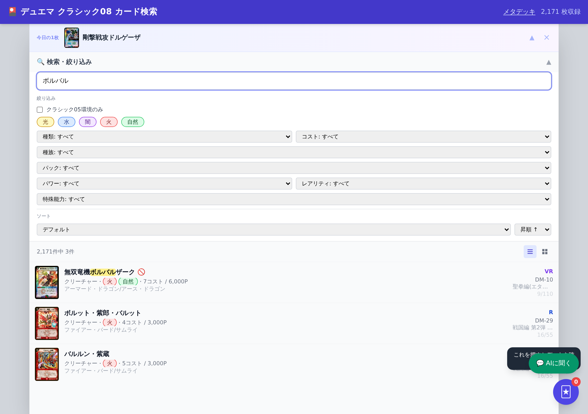
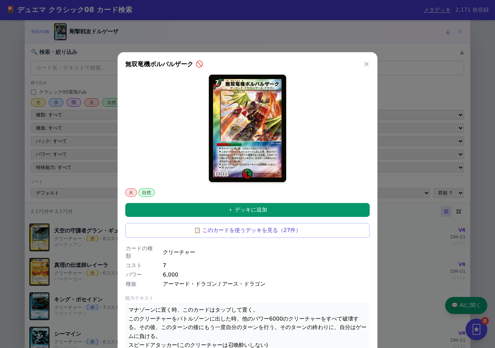

# note下書き｜クラシック08のカードを「当時のプール」で検索できるDBを作った話

> 公開先: note / 想定タイトル案（SEO考慮・いずれか）
> - 「デュエマ クラシック08 のカードを『2008年当時のプール』で検索できるDBを作りました」
> - 「クラシック08環境のデッキ構築・カード検索ツールを個人で作った話（使い方つき）」
>
> タグ候補: `デュエルマスターズ` `デュエマ` `クラシック08` `カードゲーム`
> 想定文字数: 本文 約2,400字（見出し・キャプション除く）

---

<!-- 【スクショ挿入位置①】トップページ全体（docs/screenshots/top.png）。記事の顔になるので冒頭に。 -->

## はじめに

こんにちは。デュエル・マスターズの**クラシック08**環境で遊んでいる、いち個人プレイヤーです。

この記事では、自分が趣味で作った非公式のカードデータベース
「[デュエル・マスターズ クラシック08 データベース](https://t1k2a.github.io/duelmasters-classic08-database/)」を紹介させてください。

先にお断りしておくと、**これは非営利・個人開発のファンメイド**です。
株式会社タカラトミー様および関係各社とは一切関係ありません。カード情報・画像の権利はすべて権利者に帰属します。

そして何より、クラシック08というフォーマットは、
入門記事の定番「デュエマクラシック08のすゝめ」を書かれたラテさんをはじめ、
「思い出のデュエマ」さんのような発信者、スガサワスイッチさん・チェケラッチョさんら大会を回してくださっている方々、
そういった有志の方々の積み重ねで成り立っている環境です。
自分はそこに乗らせてもらっている一人にすぎません。そのうえで、
「自分が調べもの・デッキ調整で不便だった部分」を埋める裏方の道具として、このDBを作りました。

## なぜ作ったのか

クラシック08で遊んでいると、カードを調べる場面が本当に多いです。
公式のカード検索やDMvault、各種Wikiにはいつもお世話になっています。

ただ、これらは基本的に**全期間を網羅**しているデータベースです。
そのため、遊んでいて地味に困ることがありました。

- このカード、そもそも**2008年時点のプールに存在するのか**を毎回確認しないといけない
- **当時の殿堂レギュレーション**（殿堂・プレミアム殿堂）がどうだったかを別途調べ直す

つまり「今の情報」ではなく「08環境の情報」に絞り込む一手間が、毎回かかっていたわけです。
だったら、**最初から2008年時点のカードプールに絞ったDB**があれば、その手間がまるごと消えるはず。
それが、このデータベースを作った動機です。

<!-- 【スクショ挿入位置②】カード検索の絞り込みUI。文明や殿堂バッジが見える状態のスクショ推奨。 -->

## どんなことができるのか

現時点で収録しているのは、**カード2,134枚**と**デッキレシピ462件**です。
主な機能はこんな感じです。

### 1. カード検索（08プールに限定）

文明（光/水/闇/火/自然）、種類、コスト、種族、パック、パワー、レアリティ、特殊能力で絞り込めます。
名前やテキストのインクリメンタル検索・ハイライトにも対応していて、リスト表示とグリッド表示を切り替えられます。
**表示されるのはすべて08環境のカード**なので、「これ当時あったっけ？」を気にせず探せます。

### 2. カード詳細ページ（殿堂バッジつき）

カード1枚ごとに個別ページ（例: `/card/dm01-001/`）を持っていて、
**当時の殿堂レギュレーション**を殿堂🏅・プレミアム殿堂🚫のバッジで表示します。
個別URLがあるのでSNSで共有したり、あとで見返したりもしやすいです。

<!-- 【スクショ挿入位置③】カード詳細ページ（殿堂バッジが見えるカードだと訴求が強い）。 -->

### 3. デッキビルダー

カードを選んで40枚のデッキを組み立てられます。頭の中の構築を実際に並べて確認する用途に。

### 4. デッキレシピ推薦

カード詳細から、**そのカードを実際に採用している実戦レシピ**を推薦表示します。
「このカード、どんなデッキで使われてるんだろう」がその場でわかります。関連カードも一緒に出ます。

### 5. メタデッキTier表

クラシック08環境の主要メタデッキ
（ボルメテウスコントロール / 天門 / サバキストライク / 除去サファイア / ネクラコントロール）を解説しています。
「今の環境、何が強いんだっけ」の把握や、これから始める人の道しるべに。

<!-- 【スクショ挿入位置④】メタデッキTier表ページ（docs/screenshots/meta.png）。 -->

### 6. 今日の1枚

日替わりでカードをピックアップします。ふらっと開いて「あ、このカード懐かしい」となる用の小さな仕掛けです。

## 使い方

難しい準備はいりません。
ブラウザで [デモサイト](https://t1k2a.github.io/duelmasters-classic08-database/) を開くだけで全機能が使えます。
スマホからでもそのまま使えます。

デッキを調整したいとき、相手のデッキに入っていたカードを調べたいとき、
これから08を始めてみたいとき——そんな場面で気軽に開いてもらえたら嬉しいです。

## これから

まだ個人が趣味で作っているものなので、至らない点もあると思います。
「このカードのデータが違う」「こういう検索ができると嬉しい」といったご指摘・ご要望があれば、
Xなどで教えていただけると、少しずつ直していきます。

繰り返しになりますが、このDBはクラシック08という環境を支えてこられた方々の土台があってこそのものです。
その環境で遊ぶ人が、ほんの少しだけ調べものをラクにできる。そんな裏方の道具として使ってもらえたら本望です。

もしよかったら、一度触ってみてください。

🔗 **デュエル・マスターズ クラシック08 データベース**
https://t1k2a.github.io/duelmasters-classic08-database/

<!-- 【記事末尾のサービス導線】上記リンクを記事末に必ず再掲（note SEO作法）。X告知投稿へのリンクを添えてもよい。 -->

---

### 補足: 連載化のヒント（公開時は削除）
- 第2弾以降のネタ: 「メタデッキ解説（Tier表の各デッキを1本ずつ）」「デッキビルダーで実際に1つ組んでみた」
  「08環境のカードプールの特徴」など。連載にすることでnoteのフォロー導線になる。
- 各記事末尾に必ずDBリンクを再掲する。
