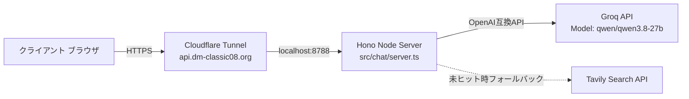

# チャットAPIサーバー 運用・デプロイ手順書

本ドキュメントは、デュエマクラシック08「AIに聞く」チャットバックエンド（AWS EC2 / Cloudflare Tunnel / Hono）の更新手順および障害発生時の復旧手順をまとめたものです。

---

## 1. システムアーキテクチャ概要



- **ホスティング環境**: AWS EC2
- **公開経路**: Cloudflare Tunnel（`https://api.dm-classic08.org`）
- **プロバイダ**: Groq (`CHAT_PROVIDER=groq`)
- **既定モデル**: `qwen/qwen3.8-27b`（フォールバック候補: `openai/gpt-oss-120b`, `openai/gpt-oss-20b`, `qwen/qwen3.6-27b`）

---

## 2. 本番環境への更新・再起動手順

モデル設定変更やコード修正を反映する際は、EC2 サーバー上で以下のステップを実行します。

### Step 1: EC2 サーバーへ SSH 接続
```bash
ssh -i ~/.ssh/<your-key>.pem ubuntu@<ec2-ip-or-host>
cd /home/ubuntu/duelmasters-classic08-database  # または配置先パス
```

### Step 2: 最新コードの取得
```bash
git fetch origin main
git checkout main
git pull origin main
```

### Step 3: 環境変数の確認・更新
`.env` ファイルを開き、`GROQ_MODEL` が最新の有効なモデルになっていることを確認します：
```bash
# .env の確認
grep GROQ_MODEL .env

# 必要に応じて更新
sed -i 's/GROQ_MODEL=.*/GROQ_MODEL="qwen\/qwen3.8-27b"/' .env
```

### Step 4: サービスの再起動
本番環境で systemd または pm2 / Docker を使用している場合：

**systemd の場合:**
```bash
sudo systemctl restart dm-chat.service
# 起動ログの確認
sudo journalctl -u dm-chat.service -n 50 -f
```

**pm2 の場合:**
```bash
pm2 restart dm-chat
pm2 logs dm-chat --lines 50
```

---

## 3. 動作確認（スモークテスト）

反映後、以下のコマンドでヘルスチェックと実際のストリーミング生成を検証します。

### ① ヘルスチェック確認
```bash
curl -s https://api.dm-classic08.org/api/health
# 期待される出力:
# {"status":"ok","provider":"groq","up":true,"model":"qwen/qwen3.8-27b","depth":0}
```
※ `up: true` かつモデル名が `qwen/qwen3.8-27b` であることを確認。

### ② チャットスモークテスト
```bash
curl -N -X POST https://api.dm-classic08.org/api/chat \
  -H "Content-Type: application/json" \
  -H "Origin: https://t1k2a.github.io" \
  -H "User-Agent: Mozilla/5.0" \
  -d '{"question":"パワー5000以上のブロッカーは？","history":[]}'
```
※ `data: {"error":"ERROR","done":true}` ではなく、カード名のトークンおよび `done: true` が返ることを確認。

---

## 4. モデル障害・404発生時の緊急対応

Groq 無料枠のモデル提供が終了した場合（404 `model_not_found`）：
1. 自動フォールバック（`DEFAULT_FALLBACK_MODELS`）により、サーバーは自動的に次候補モデル（`openai/gpt-oss-120b` 等）へ切り替えて回答を試行します。
2. Groqの最新提供モデルを確認：
   ```bash
   curl https://api.groq.com/openai/v1/models -H "Authorization: Bearer $GROQ_API_KEY" | jq '.data[].id'
   ```
3. 利用可能な最新モデルを `.env` の `GROQ_MODEL` に指定し、サービスを再起動してください。